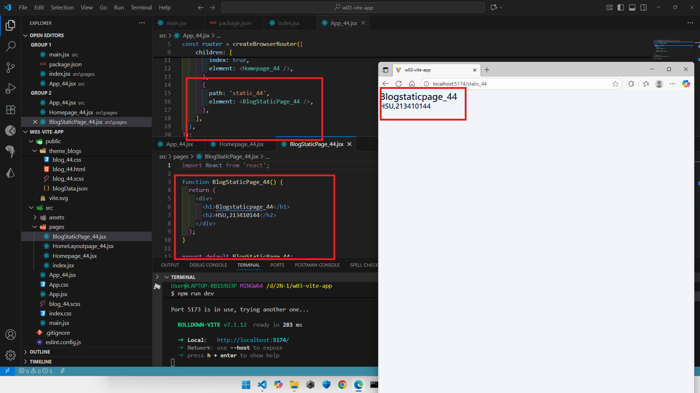
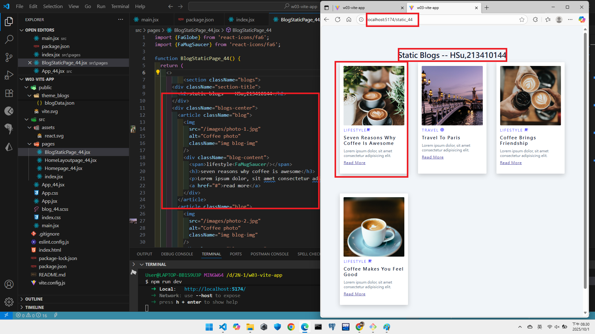
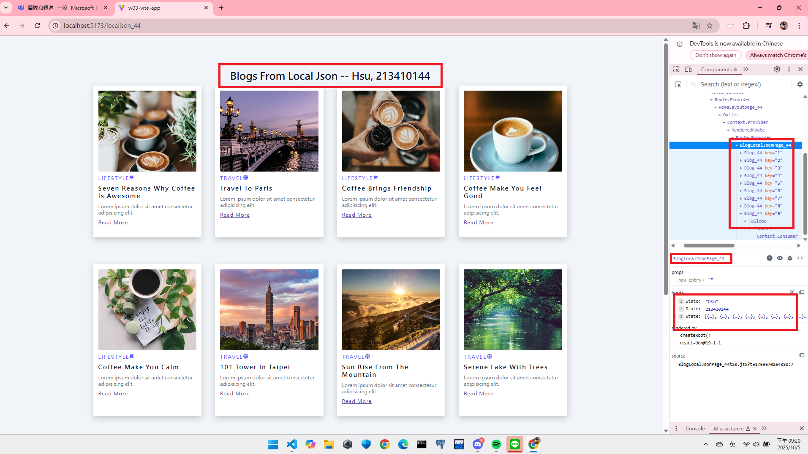
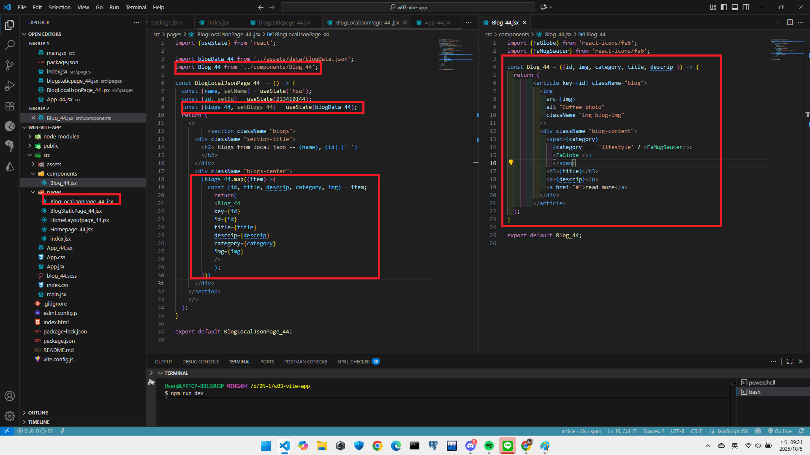
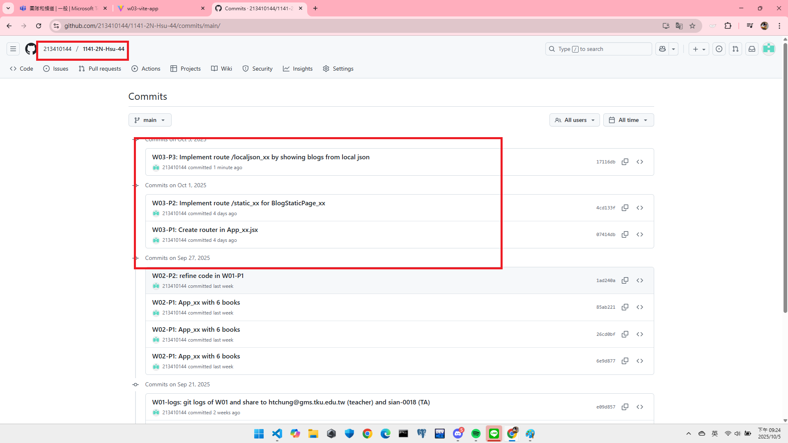

[Github URL](https://github.com/213410144/1141-2N-Hsu-44.git)

### W03-P1: Create router in App_xx.jsx
 
#### => route / for HomePage_xx
 

 
#### => route /static_xx for BlogStaticPage_xx
 

 
```
07414db 213410144       Wed Oct 1 19:58:22 2025 +0800   W03-P1: Create router in App_xx.jsx
```
 ### W03-P2: Implement route /static_xx for BlogStaticPage_xx
 

 
```
4cd133f 213410144       Wed Oct 1 20:32:00 2025 +0800   W03-P2: Implement route /static_xx for BlogStaticPage_xx
```

### W03-P3: Implement route /localjson_xx by showing blogs from local json
 
#### => Chrome demo using React DevTools
 

 
#### => code for BlogLocalJson_xx
 

 
```
17116db 213410144       Sun Oct 5 21:22:29 2025 +0800   W03-P3: Implement route /localjson_xx by showing blogs from local json
```
