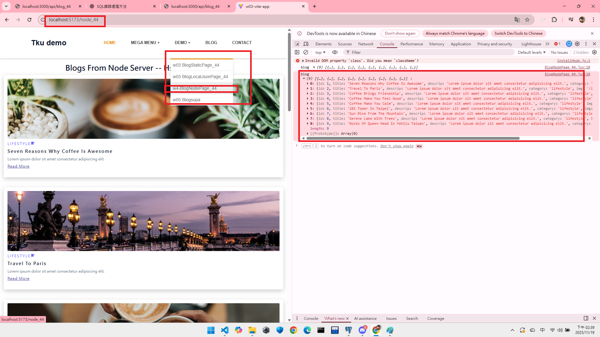
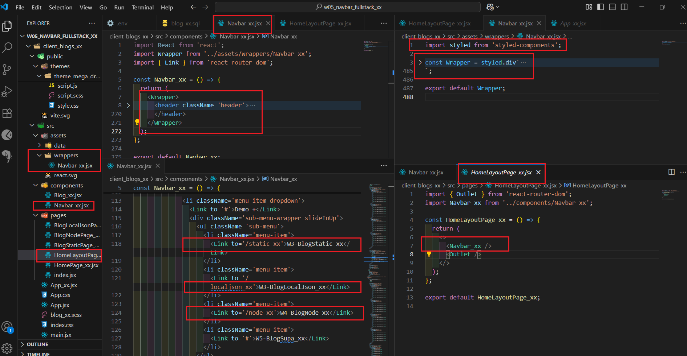
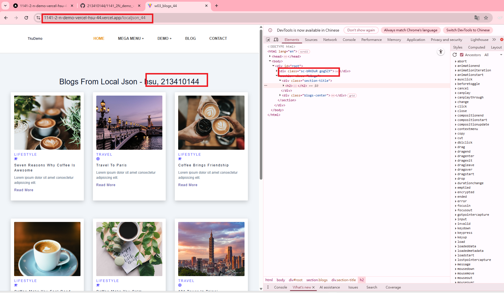
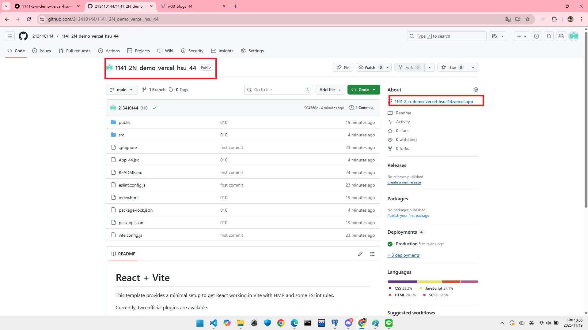
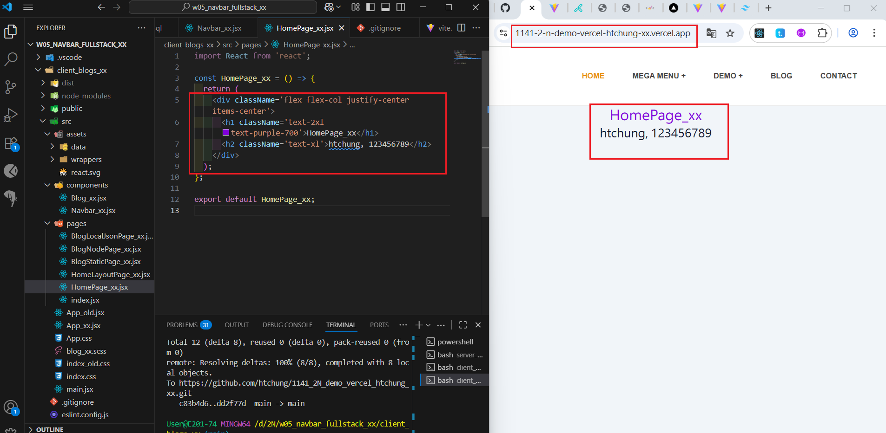
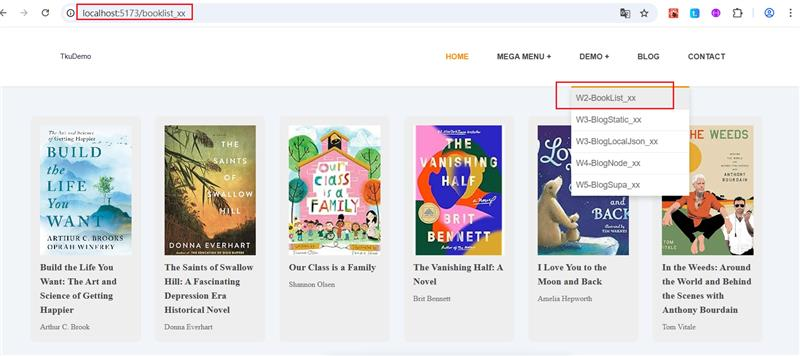

[Github URL](https://github.com/213410144/1141-2N-Hsu-44.git)

### W05-P1: Create Navbar_xx using styled components, and show BlogNodePage_xx
 
##### => Chrome
 

 
##### => relevant code
 

 
```

```
### W05-P2: Deploy the code to Vercel
 
#### => Show BlogLocalJson in Vercel
 

 
#### => Github repo with Vercel link
 

 
#### => Github demo_vecel repo and Vercel URL
 
[Github URL for Vercel](https://github.com/213410144/1141-2N-Hsu-44.git)
[Vercel URL](https://1141-2-n-demo-vercel-hsu-44.vercel.app/)
 
```

```
###W05-P3: Use tailwind css to show HomePage_xx in Vercel
 

 
```

```

### W05-P4: Show BookListPage_xx using styled components
 

 
```

```