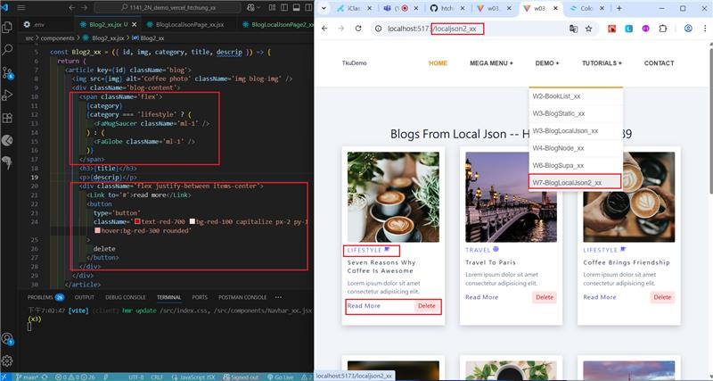
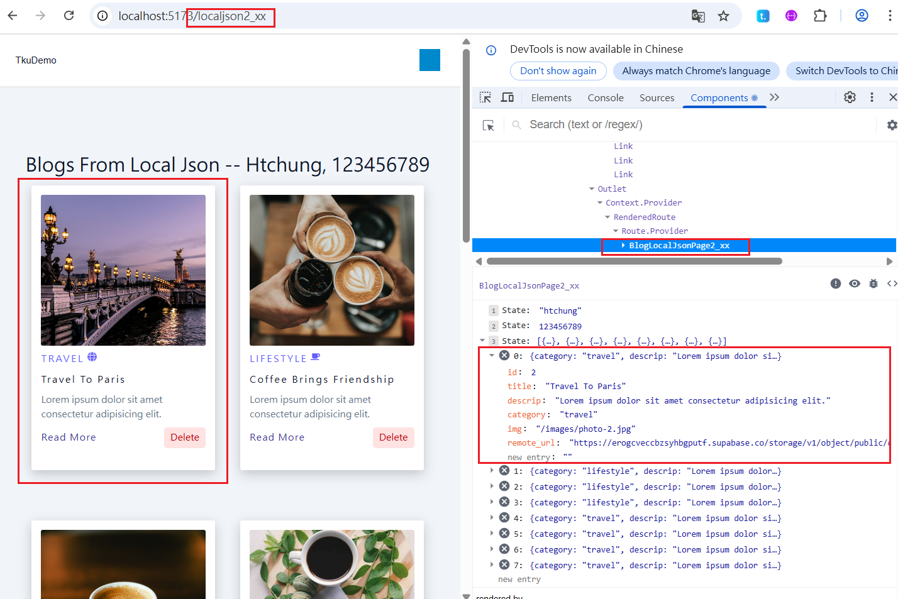
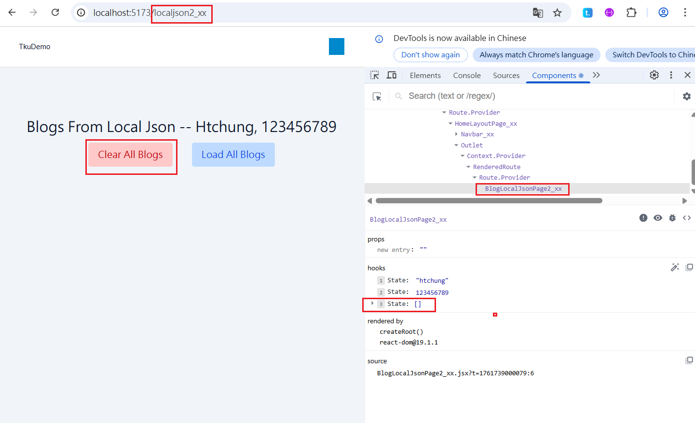
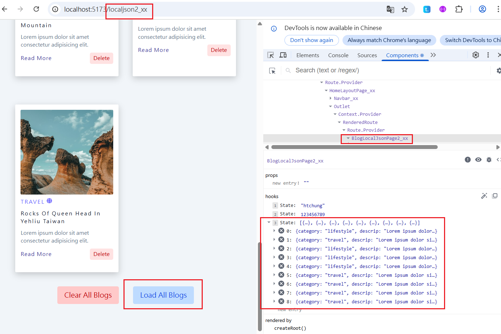
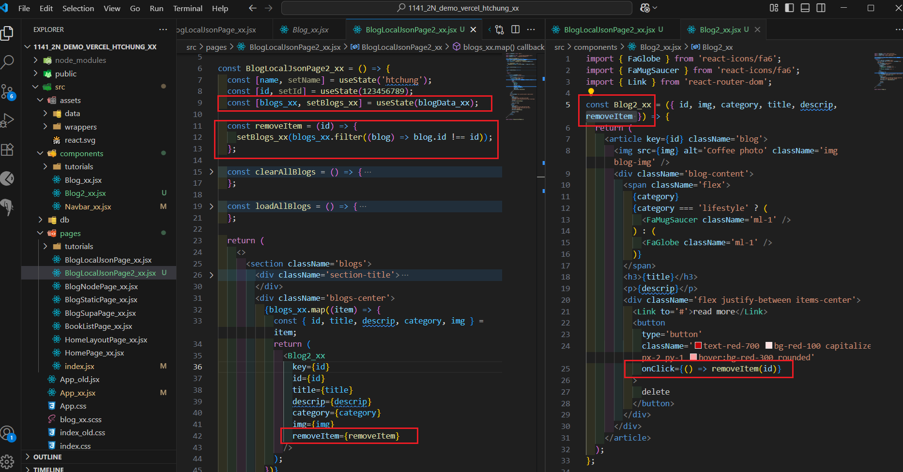
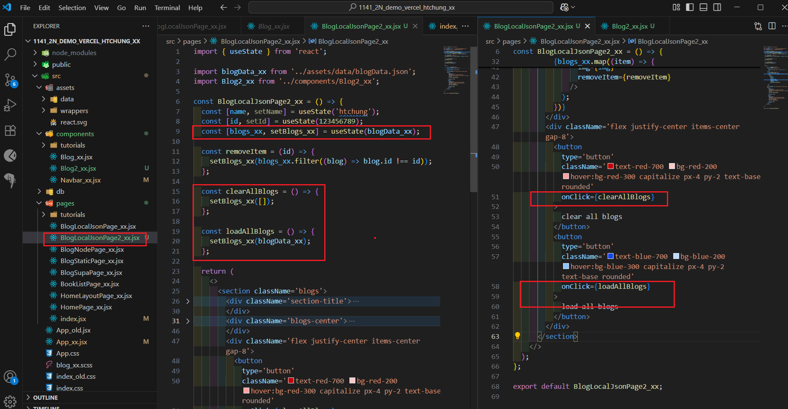
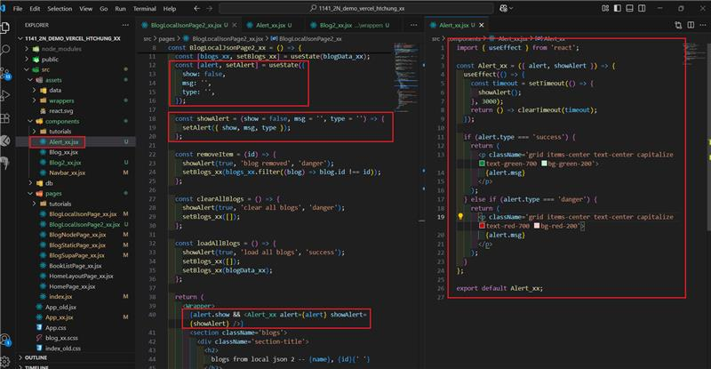

[Github URL](https://github.com/213410144/1141-2N-Hsu-44.git)


 
W07-P1: Use tailwind to style react icons and add a delete button
 

 
```
6ace703 htchung Wed Oct 29 19:08:12 2025 +0800  W07-P1: Use tailwind to style react icons and add a delete button
```

W07-P2: Implement delete a blog, clear all blogs, load all blogs
 
#### => delete first blog
 

 
#### => clear all blogs
 

 
#### => load all blogs
 

 
#### => code for deleting a blog
 

 
#### => code for clear and load all blogs
 

 
```
d0ff7b4 htchung Wed Oct 29 20:07:33 2025 +0800  W07-P2: Implement delete a blog, clear all blogs, load all blogs
```

W07-P3: Implement Alert_xx
 
#### => code for Alert_xx
 

 
```
9c2d338 htchung Wed Oct 29 21:04:08 2025 +0800  W07-P3: Implement Alert_xx
```